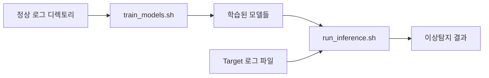

# 🚀 학습/추론 분리 워크플로우 가이드

## 📋 개요

기존 `run_enhanced_batch_analysis.sh`에서 학습과 추론을 분리하여 더 효율적이고 유연한 워크플로우를 제공합니다.

## 🔄 워크플로우 구조



## 📚 두 단계 프로세스

### 1️⃣ **학습 단계** (`train_models.sh`)
정상 로그 데이터로부터 이상탐지 모델들을 학습합니다.

### 2️⃣ **추론 단계** (`run_inference.sh`)
학습된 모델들을 사용하여 Target 로그의 이상을 탐지합니다.

---

## 🎯 1단계: 모델 학습

### 사용법
```bash
./train_models.sh <로그디렉토리> [모델저장디렉토리] [최대깊이] [최대파일수]
```

### 예시
```bash
# 기본 사용법
./train_models.sh /var/log/normal/

# 모델 저장 위치 지정
./train_models.sh /var/log/normal/ my_models

# 세부 옵션 지정
./train_models.sh /var/log/normal/ my_models 5 100
```

### 매개변수 설명
- **로그디렉토리**: 정상 로그 파일들이 있는 폴더 (학습용)
- **모델저장디렉토리**: 학습된 모델들을 저장할 폴더 (생략시 자동 생성)
- **최대깊이**: 하위 디렉토리 스캔 깊이 (기본: 3)
- **최대파일수**: 학습에 사용할 최대 파일 수 (기본: 50)

### 학습 과정
1. **로그 파일 스캔**: 하위 디렉토리 재귀적 스캔
2. **전처리**: Drain3 템플릿 추출 및 파싱
3. **베이스라인 학습**: 정상 패턴 통계 생성
4. **DeepLog 학습**: LSTM 시퀀스 예측 모델 학습
5. **MS-CRED 학습**: 멀티스케일 컨볼루션 모델 학습
6. **메타데이터 저장**: 학습 정보 및 설정 저장

### 생성되는 파일들
```
models_20241002_143022/
├── deeplog.pth              # DeepLog LSTM 모델
├── mscred.pth               # MS-CRED 컨볼루션 모델
├── vocab.json               # 템플릿 어휘 사전
├── baseline_stats.json      # 베이스라인 정상 패턴 통계
├── drain3_state.json        # Drain3 템플릿 상태
├── metadata.json            # 학습 메타데이터
└── training_workspace/      # 임시 학습 파일들
```

---

## 🔍 2단계: 이상탐지 추론

### 사용법
```bash
./run_inference.sh <모델디렉토리> <target로그파일> [결과디렉토리]
```

### 예시
```bash
# 기본 사용법
./run_inference.sh models_20241002_143022 /var/log/suspicious.log

# 결과 저장 위치 지정
./run_inference.sh models_20241002_143022 /var/log/suspicious.log my_results
```

### 매개변수 설명
- **모델디렉토리**: `train_models.sh`로 생성된 학습 모델 폴더
- **target로그파일**: 이상탐지를 수행할 로그 파일
- **결과디렉토리**: 분석 결과를 저장할 폴더 (생략시 자동 생성)

### 추론 과정
1. **Target 전처리**: 기존 Drain3 상태로 로그 파싱
2. **베이스라인 탐지**: 학습된 통계와 비교하여 이상 탐지
3. **DeepLog 추론**: LSTM 모델로 시퀀스 예측 위반 탐지
4. **MS-CRED 추론**: 컨볼루션 모델로 재구성 오차 기반 탐지
5. **시간 기반 분석**: 시간대별 패턴 비교
6. **종합 리포트**: 모든 결과를 통합한 리포트 생성

### 생성되는 파일들
```
inference_20241002_150022/
├── parsed.parquet                    # 전처리된 Target 로그
├── baseline_scores_enhanced.parquet  # 베이스라인 이상탐지 결과
├── deeplog_infer.parquet            # DeepLog 추론 결과
├── mscred_infer.parquet             # MS-CRED 추론 결과
├── temporal_analysis/               # 시간 기반 분석 결과
├── inference_report.md              # 종합 이상탐지 리포트
└── ...
```

---

## 💡 주요 장점

### 🔄 **효율성**
- **재사용 가능한 모델**: 한 번 학습하면 여러 Target 로그에 적용
- **빠른 추론**: 학습 과정 없이 즉시 이상탐지 수행
- **자원 절약**: 학습과 추론을 분리하여 컴퓨팅 자원 효율적 사용

### 🎯 **유연성**
- **다양한 Target**: 학습된 모델로 다른 시스템/시간대 로그 분석
- **점진적 학습**: 새로운 정상 로그로 모델 업데이트 가능
- **선택적 실행**: 필요한 모델만 선택하여 추론 수행

### 🛡️ **안정성**
- **일관된 기준**: 동일한 학습 모델로 일관된 이상탐지 기준 적용
- **버전 관리**: 모델별 메타데이터로 학습 이력 추적
- **오류 격리**: 학습 실패가 추론에 영향 주지 않음

---

## 🔧 고급 사용법

### 배치 추론
여러 Target 파일을 순차적으로 분석:

```bash
MODEL_DIR="models_20241002_143022"

for log_file in /var/log/targets/*.log; do
    echo "분석 중: $log_file"
    ./run_inference.sh "$MODEL_DIR" "$log_file" "results_$(basename "$log_file" .log)"
done
```

### 모델 업데이트
새로운 정상 로그로 모델 재학습:

```bash
# 기존 모델 백업
cp -r models_20241002_143022 models_backup

# 새로운 데이터로 재학습
./train_models.sh /var/log/new_normal/ models_updated
```

### 선택적 모델 사용
특정 모델만 사용하여 추론 (스크립트 수정 필요):

```bash
# DeepLog만 사용하고 싶은 경우
# run_inference.sh에서 MS-CRED 부분을 주석 처리
```

---

## 🚨 문제 해결

### 학습 단계 문제

**Q: 로그 파일을 찾을 수 없다고 나옵니다.**
```bash
# 디렉토리 구조 확인
find /var/log -name "*.log" -type f | head -10

# 권한 확인
ls -la /var/log/
```

**Q: 메모리 부족으로 학습이 실패합니다.**
```bash
# 파일 수 제한
./train_models.sh /var/log/normal/ my_models 2 20

# 큰 파일들 제외
find /var/log -name "*.log" -size +100M
```

### 추론 단계 문제

**Q: 모델 파일이 없다고 나옵니다.**
```bash
# 모델 디렉토리 확인
ls -la models_20241002_143022/

# 필수 파일들 확인
ls -la models_20241002_143022/{deeplog.pth,mscred.pth,vocab.json,drain3_state.json}
```

**Q: Target 로그 형식이 다릅니다.**
- Drain3는 기존 템플릿 상태를 사용하므로 어느 정도 다른 형식도 처리 가능
- 너무 다른 형식이면 새로운 정상 로그로 재학습 권장

---

## 📊 성능 벤치마크

### 학습 시간 (참고용)
- **소규모** (1-10MB, 10개 파일): 5-10분
- **중규모** (10-100MB, 50개 파일): 15-30분  
- **대규모** (100MB+, 100개+ 파일): 30분-2시간

### 추론 시간 (참고용)
- **소규모** Target (1-10MB): 1-3분
- **중규모** Target (10-100MB): 3-10분
- **대규모** Target (100MB+): 10-30분

---

## 🔗 고급 도구들

### 🆕 **모델 비교 도구** (`compare_models.sh`)
서로 다른 시점에 학습된 모델들의 성능을 비교:
```bash
# 두 모델 성능 비교
./compare_models.sh models_old models_new

# 특정 테스트 데이터로 비교
./compare_models.sh models_old models_new /var/log/test.log
```

### 🆕 **점진적 학습** (`train_models_incremental.sh`)
기존 모델에 새로운 데이터를 추가하여 점진적으로 업데이트:
```bash
# 기존 모델을 새 데이터로 업데이트
./train_models_incremental.sh models_old /var/log/new_normal/ models_updated

# 업데이트된 모델로 추론
./run_inference.sh models_updated /var/log/target.log
```

### 🆕 **모델 검증** (`validate_models.sh`)
학습된 모델의 품질과 성능을 자동으로 검증:
```bash
# 모델 품질 검증
./validate_models.sh models_20241002_143022

# 특정 검증 데이터로 테스트
./validate_models.sh models_20241002_143022 /var/log/validation.log
```

### 기존 통합 분석
여전히 기존 방식도 사용 가능:
```bash
./run_enhanced_batch_analysis.sh /var/log/ target.log
```

### 추가 분석 도구
```bash
# 결과 상세 분석
python analyze_results.py --data-dir inference_results/

# 시각화
python visualize_results.py --data-dir inference_results/

# MS-CRED 전용 분석
alog-detect analyze-mscred --data-dir inference_results/
```

---

## 🔄 완전한 워크플로우 예시

### 시나리오: 새로운 시스템 모니터링 구축

```bash
# 1단계: 정상 로그로 초기 모델 학습
./train_models.sh /var/log/normal_baseline/ baseline_models

# 2단계: 모델 품질 검증
./validate_models.sh baseline_models
# → 품질 점수 85/100 (양호)

# 3단계: 의심스러운 로그 분석
./run_inference.sh baseline_models /var/log/suspicious.log

# 4단계: 추가 정상 데이터로 모델 개선
./train_models_incremental.sh baseline_models /var/log/new_normal/ improved_models

# 5단계: 개선된 모델 성능 비교
./compare_models.sh baseline_models improved_models /var/log/test.log

# 6단계: 최종 모델 검증
./validate_models.sh improved_models
# → 품질 점수 92/100 (우수)

# 7단계: 프로덕션 배포
./run_inference.sh improved_models /var/log/production.log
```

---

## 🎉 결론

**학습/추론 분리 + 고급 도구**를 통해:

1. **효율적인 모델 재사용**으로 시간과 자원 절약
2. **점진적 학습**으로 지속적인 모델 개선
3. **자동화된 검증**으로 모델 품질 보장
4. **성능 비교**로 최적 모델 선택
5. **유연한 이상탐지**로 다양한 시나리오 대응  
6. **일관된 분석 기준**으로 신뢰할 수 있는 결과 제공

이제 정상 로그로 한 번 학습하고, 지속적으로 개선하며, 다양한 Target 로그들을 정확하게 분석해보세요! 🚀
