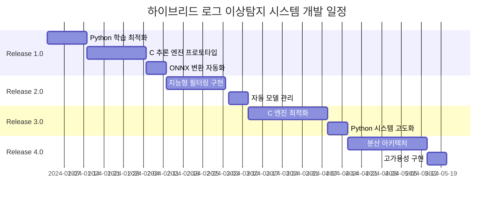

# 🚀 실시간 로그 이상탐지 시스템 릴리즈 계획

## 📋 프로젝트 개요

**목표**: 현재 배치 처리 기반 로그 이상탐지 시스템을 실용적인 준실시간 시스템으로 진화

**핵심 철학**: 
- 완전한 실시간보다는 **실용적인 준실시간** (5-10초 지연)
- **하이브리드 아키텍처**: Python 학습 + C 추론
- 높은 정확도와 안정성 우선
- 점진적 성능 개선 및 확장성 확보

## 🏗️ **하이브리드 아키텍처 개요**

```
┌─────────────────┐    ┌─────────────────┐    ┌─────────────────┐
│   Python 학습    │───▶│   모델 변환      │───▶│   C 추론 엔진    │
│   (오프라인)     │    │   (ONNX/TRT)    │    │   (실시간)      │
└─────────────────┘    └─────────────────┘    └─────────────────┘
        │                        │                        │
   파일 기반 배치              모델 아티팩트           스트림 처리
   대용량 데이터 처리          최적화된 형태           저지연 추론
```

### 🎯 **핵심 설계 원칙**

**학습 시스템 (Python - 오프라인)**
- ✅ **현재 구조 유지**: 기존 배치 처리 방식 그대로 활용
- ✅ **파일 기반 처리**: 대용량 로그 파일의 효율적 처리
- ✅ **GPU 활용**: 복잡한 딥러닝 모델 학습에 최적화
- ✅ **풍부한 생태계**: pandas, PyTorch, sklearn 등 활용

**추론 시스템 (C - 실시간)**
- ✅ **파일 기반 처리**: 주기적 로그 파일 스캔 및 실시간 처리
- ✅ **ONNX Runtime**: PyTorch 모델의 고성능 실행
- ✅ **최소 지연시간**: 메모리 기반 시퀀스 처리
- ✅ **높은 처리량**: 최적화된 C 구현으로 동시성 극대화

### 🔄 **모델 업데이트 워크플로우**

```
┌─────────────────┐
│ 1. 로그 수집     │ ← 실시간 로그를 파일로 저장 (일별/시간별)
│   (실시간)      │
└─────────────────┘
         │
         ▼
┌─────────────────┐
│ 2. 배치 학습     │ ← Python으로 주기적 재학습 (일별/주별)
│   (Python)      │
└─────────────────┘
         │
         ▼
┌─────────────────┐
│ 3. 모델 변환     │ ← PyTorch → ONNX 자동 변환
│   (자동화)      │
└─────────────────┘
         │
         ▼
┌─────────────────┐
│ 4. 모델 배포     │ ← C 엔진에 핫스왑 배포 (무중단)
│   (무중단)      │
└─────────────────┘
```

---

## 🎯 릴리즈 로드맵

### 📦 **Release 1.0: 하이브리드 프로토타입 구축** 
*예상 기간: 4-6주* **🔄 진행 중 (75% 완료)**

#### 🎯 목표
- ✅ Python 학습 파이프라인 유지 및 최적화
- ✅ C 기반 실시간 추론 엔진 프로토타입 구현
- ✅ ONNX 모델 변환 자동화 구축
- 🔄 파일 기반 주기적 처리 구현 (진행 중)
- 🔄 MS-CRED 추론 모델 통합 (예정)

#### 🔧 주요 기능

**Python 학습 시스템 (기존 유지)**
- ✅ **배치 학습 파이프라인**: 현재 구조 그대로 유지
- ✅ **모델 변환 자동화**: PyTorch → ONNX 변환 스크립트
- ✅ **자동 변환 파이프라인**: 학습 → 변환 → 배포 자동화

**C 추론 엔진 (신규 구현)**
- ✅ **ONNX Runtime 통합**: 변환된 모델의 고성능 실행
- ✅ **로그 파싱**: cJSON 기반 템플릿 매칭
- ✅ **시퀀스 관리**: 순환 버퍼 기반 효율적 시퀀스 처리
- ✅ **DeepLog 추론**: Top-K 기반 이상탐지
- 🔄 **파일 모니터링**: inotify 기반 실시간 파일 감시 (진행 중)
- 🔄 **MS-CRED 추론**: 윈도우 기반 이상탐지 (예정)

#### 📊 성능 목표
| 항목 | 목표 값 | 현재 값 |
|------|---------|---------|
| 평균 지연시간 | < 10초 | 분-시간 단위 |
| 처리량 | 1,000 logs/sec | 배치 단위 |
| CPU 사용률 | < 30% | 간헐적 100% |
| 메모리 사용량 | < 500MB | 1GB+ |

#### 🛠️ 기술 스택
- **학습**: Python 3.8+, PyTorch, pandas (기존 유지)
- **추론**: C99, ONNX Runtime C API, pthread
- **파일 처리**: inotify, poll 기반 파일 모니터링
- **모니터링**: JSON 결과 파일, 로그 출력

#### 📁 주요 컴포넌트
```
hybrid_system/
├── training/                    # Python 학습 시스템
│   ├── batch_trainer.py         # 기존 학습 파이프라인 ✅
│   ├── model_converter.py       # ONNX 변환 도구 ✅
│   └── auto_converter.py        # 자동 변환 및 배포 ✅
├── inference/                   # C 추론 엔진
│   ├── src/
│   │   ├── onnx_engine.c        # ONNX 추론 엔진 ✅
│   │   ├── log_parser.c         # 로그 파싱 및 템플릿 매칭 ✅
│   │   ├── anomaly_detector.c   # 이상탐지 로직 (DeepLog) ✅
│   │   └── main.c               # CLI 인터페이스 ✅
│   ├── include/
│   │   └── inference_engine.h   # API 헤더 ✅
│   ├── Makefile                 # 빌드 시스템 ✅
│   └── README.md                # 사용법 문서 ✅
├── bridge/                      # Python-C 브리지
│   ├── model_deployer.py        # 모델 배포 자동화
│   └── monitoring.py            # 성능 모니터링
└── config/
    ├── training_config.yaml     # 학습 설정
    └── inference_config.yaml    # 추론 설정
```

---

### 📦 **Release 2.0: 지능형 필터링 및 최적화**
*예상 기간: 3-4주* **📋 계획됨**

#### 🎯 목표
- MS-CRED 추론 모델 통합 완료
- 파일 모니터링 시스템 완성
- 2단계 필터링으로 ML 모델 부하 90% 감소
- 지연시간 1-5초로 단축

#### 🔧 주요 기능

**지능형 필터링 (C 엔진 강화)**
- **MS-CRED 통합**: 윈도우 기반 이상탐지 모델 추가
- **파일 모니터링**: inotify 기반 실시간 파일 감시
- **1차 필터**: 빠른 규칙 기반 필터링 (< 1ms)
- **2차 분석**: 의심 로그만 ML 모델 적용 (< 100ms)

**모델 관리 시스템 (Python)**
- **자동 재학습**: 주기적 모델 업데이트 파이프라인
- **A/B 테스트**: 새 모델과 기존 모델 성능 비교
- **점진적 배포**: 카나리 배포를 통한 안전한 모델 교체
- **성능 모니터링**: 실시간 정확도 및 성능 추적

#### 📊 성능 목표
| 항목 | 목표 값 | 1.0 대비 개선 |
|------|---------|---------------|
| 평균 지연시간 | < 3초 | 3x 개선 |
| 처리량 | 10,000 logs/sec | 10x 개선 |
| CPU 사용률 | < 20% | 33% 감소 |
| 정확도 | > 95% | 유지 |

#### 🧠 필터링 로직
```c
// C 엔진의 2단계 필터링
typedef struct {
    bool is_suspicious;
    float confidence;
    int filter_stage;  // 1: 규칙 필터, 2: ML 모델
} FilterResult;

// 1차 필터: 빠른 규칙 기반 (< 1ms)
FilterResult fast_filter(const char* log_line, RuleSet* rules) {
    // 키워드 매칭, 정규표현식
    // 99% 정상 로그 빠르게 필터링
}

// 2차 분석: ML 모델 (< 100ms)  
FilterResult deep_analysis(LogBatch* suspicious_logs, ONNXModel* model) {
    // 의심스러운 로그만 딥러닝 모델 적용
}
```

#### 🔄 **자동 모델 업데이트**
```python
# Python 기반 모델 관리 시스템
class ModelManager:
    def __init__(self):
        self.training_scheduler = TrainingScheduler()
        self.model_validator = ModelValidator()
        self.deployment_manager = DeploymentManager()
    
    def auto_retrain_pipeline(self):
        """자동 재학습 파이프라인"""
        # 1. 새로운 로그 데이터 수집
        new_data = self.collect_recent_logs()
        
        # 2. 모델 재학습
        new_model = self.retrain_model(new_data)
        
        # 3. 성능 검증
        if self.validate_model(new_model):
            # 4. ONNX 변환 및 배포
            self.deploy_model_safely(new_model)
```

---

### 📦 **Release 3.0: 고성능 C 엔진 완성**
*예상 기간: 4-5주*

#### 🎯 목표
- C 추론 엔진의 극한 최적화
- 무잠금 아키텍처로 동시성 극대화
- 메모리 사용량 80% 감소, 속도 5-10배 향상
- 프로덕션 레벨 안정성 확보

#### 🔧 주요 기능

**고성능 C 엔진 최적화**
- **무잠금 아키텍처**: Lock-free 큐와 메모리 풀 활용
- **SIMD 최적화**: AVX/SSE 명령어를 활용한 벡터 연산 가속
- **멀티코어 활용**: CPU 코어별 전용 스레드 배치
- **캐시 최적화**: 데이터 지역성을 고려한 메모리 레이아웃

**Python 학습 시스템 고도화**
- **증분 학습**: 새로운 데이터로 기존 모델 업데이트
- **앙상블 모델**: 여러 모델의 조합으로 정확도 향상
- **자동 하이퍼파라미터 튜닝**: Optuna 등을 활용한 자동 최적화
- **모델 압축**: 양자화 및 프루닝을 통한 모델 경량화

#### 📊 성능 목표
| 항목 | 목표 값 | 2.0 대비 개선 |
|------|---------|---------------|
| 추론 속도 | < 10ms | 10x 개선 |
| 메모리 사용량 | < 100MB | 5x 감소 |
| 처리량 | 50,000 logs/sec | 5x 개선 |
| 배포 크기 | < 20MB | 10x 감소 |

#### 🏗️ 최적화된 아키텍처
```
High-Performance System
├── training_system/        # Python 학습 시스템
│   ├── incremental_trainer.py    # 증분 학습
│   ├── ensemble_manager.py       # 앙상블 모델 관리
│   ├── hyperopt_tuner.py         # 하이퍼파라미터 튜닝
│   └── model_compressor.py       # 모델 압축
├── inference_engine/       # C 추론 엔진
│   ├── lockfree_queue.c          # 무잠금 큐
│   ├── memory_pool.c             # 메모리 풀
│   ├── simd_processor.c          # SIMD 최적화
│   ├── thread_manager.c          # 멀티스레드 관리
│   └── cache_optimizer.c         # 캐시 최적화
└── deployment/             # 배포 시스템
    ├── model_registry.py         # 모델 버전 관리
    ├── canary_deployer.py        # 카나리 배포
    └── health_monitor.py         # 헬스 체크
```

#### ⚡ **극한 최적화 기법**
```c
// 무잠금 순환 큐 (Lock-free Ring Buffer)
typedef struct {
    volatile uint64_t head;
    volatile uint64_t tail;
    LogEntry entries[QUEUE_SIZE];
} LockFreeQueue;

// SIMD 기반 벡터 연산
void simd_log_processing(float* features, size_t count) {
    __m256 vec_data;
    for (size_t i = 0; i < count; i += 8) {
        vec_data = _mm256_load_ps(&features[i]);
        // 벡터화된 연산 수행
        _mm256_store_ps(&features[i], processed_data);
    }
}

// CPU 친화적 스레드 배치
void bind_thread_to_cpu(int cpu_id) {
    cpu_set_t cpuset;
    CPU_ZERO(&cpuset);
    CPU_SET(cpu_id, &cpuset);
    pthread_setaffinity_np(pthread_self(), sizeof(cpuset), &cpuset);
}
```

---

### 📦 **Release 4.0: 분산 처리 및 확장성**
*예상 기간: 4-5주*

#### 🎯 목표
- 수평 확장 가능한 분산 아키텍처
- 100,000+ logs/sec 처리 능력
- 고가용성 및 장애 복구

#### 🔧 주요 기능
- **분산 처리**: 여러 노드에 걸친 로드 밸런싱
- **상태 동기화**: 모델 상태 및 학습 데이터 동기화
- **자동 스케일링**: 로그 볼륨에 따른 자동 인스턴스 확장
- **장애 복구**: 노드 장애 시 자동 복구 및 재분산

---

## 📊 단계별 성능 비교

| Release | 지연시간 | 처리량 | CPU | 메모리 | 배포 크기 | 학습 방식 | 추론 방식 |
|---------|----------|--------|-----|--------|-----------|-----------|-----------|
| **현재** | 분-시간 | 배치 | 간헐적 100% | 1GB+ | 200MB+ | Python 배치 | Python 배치 |
| **1.0** | < 10초 | 1K/sec | < 30% | 500MB | 50MB | Python 배치 | C 스트림 |
| **2.0** | < 3초 | 10K/sec | < 20% | 300MB | 30MB | Python 자동화 | C 필터링 |
| **3.0** | < 1초 | 50K/sec | < 15% | 100MB | 20MB | Python 고도화 | C 최적화 |
| **4.0** | < 500ms | 100K+/sec | 분산 | 분산 | 20MB | Python 분산 | C 분산 |

### 🔄 **하이브리드 시스템의 장점**

**학습 시스템 (Python)**
- ✅ **기존 코드 재활용**: 현재 구조를 그대로 활용
- ✅ **빠른 프로토타이핑**: 새로운 모델 실험 용이
- ✅ **풍부한 라이브러리**: ML/DL 생태계 활용
- ✅ **GPU 가속**: 대규모 모델 학습에 최적

**추론 시스템 (C)**
- ✅ **극한 성능**: 최소 지연시간 및 최대 처리량
- ✅ **낮은 리소스**: 메모리 및 CPU 사용량 최소화
- ✅ **높은 안정성**: 메모리 안전성 및 예측 가능한 성능
- ✅ **쉬운 배포**: 최소 의존성으로 배포 간소화

---

## 🎯 적용 시나리오별 권장 버전

### 🏢 **일반 웹 서비스** (1,000 logs/sec)
- **권장**: Release 1.0 또는 2.0
- **특징**: 적당한 로그 볼륨, 비용 효율성 중시
- **설정**: 10초 배치, 기본 필터링

### 💰 **금융/결제 시스템** (10,000 logs/sec)
- **권장**: Release 2.0 또는 3.0
- **특징**: 높은 정확도 요구, 빠른 대응 필요
- **설정**: 3초 배치, 강화된 필터링, 실시간 알림

### 🏭 **대규모 플랫폼** (100,000+ logs/sec)
- **권장**: Release 3.0 또는 4.0
- **특징**: 대용량 처리, 고가용성 필요
- **설정**: 분산 처리, 샘플링, 자동 스케일링

---

## 🛠️ 개발 환경 및 도구

### 📋 **필수 도구**
```bash
# 개발 환경
Python 3.8+, GCC 4.9+, Make

# ONNX Runtime
ONNX Runtime C API 1.16.0+

# 파일 모니터링
inotify (Linux), kqueue (macOS)

# 모니터링  
JSON 결과 파일, 로그 출력

# 빌드 도구
Make, pkg-config
```

### 🧪 **테스트 전략**
- **단위 테스트**: 각 컴포넌트별 기능 테스트
- **통합 테스트**: 전체 파이프라인 테스트
- **성능 테스트**: 부하 테스트 및 벤치마킹
- **장애 테스트**: 카오스 엔지니어링

---

## 📈 **비즈니스 가치**

### 💡 **즉시 효과** (Release 1.0)
- 이상 상황 대응 시간 **90% 단축** (시간 → 초 단위)
- 운영 효율성 **3배 향상**
- 장애 예방을 통한 **비용 절감**

### 🚀 **장기 효과** (Release 4.0)
- 대규모 시스템 지원으로 **사업 확장성** 확보
- 실시간 인사이트 제공으로 **경쟁 우위** 확보
- 자동화를 통한 **운영 비용 80% 절감**

---

## ⚠️ **리스크 및 대응 방안**

### 🔴 **기술적 리스크**
| 리스크 | 확률 | 영향도 | 대응 방안 |
|--------|------|--------|-----------|
| 성능 목표 미달성 | 중 | 고 | 단계적 최적화, 대안 기술 검토 |
| 모델 정확도 저하 | 낮 | 고 | A/B 테스트, 점진적 배포 |
| 시스템 복잡도 증가 | 높 | 중 | 모듈화 설계, 충분한 테스트 |

### 🟡 **운영 리스크**
| 리스크 | 확률 | 영향도 | 대응 방안 |
|--------|------|--------|-----------|
| 인력 부족 | 중 | 중 | 외부 전문가 활용, 단계적 개발 |
| 일정 지연 | 중 | 중 | 버퍼 기간 확보, 우선순위 조정 |
| 예산 초과 | 낮 | 중 | 오픈소스 활용, 클라우드 최적화 |

---

## 📅 **마일스톤 및 일정**



### 🎯 **구현 우선순위**

**Phase 1: 하이브리드 기반 구축 (1.0)**
1. **Python 학습 파이프라인 유지** - 기존 코드 활용 ✅
2. **ONNX 변환 도구 개발** - PyTorch → ONNX 자동화 ✅
3. **C 추론 엔진 프로토타입** - 기본 ONNX Runtime 통합 ✅
4. **파일 기반 처리 구현** - 주기적 로그 파일 스캔 (진행 중)

**Phase 2: 지능형 최적화 (2.0)**
1. **MS-CRED 추론 추가** - C 엔진에 MS-CRED 모델 통합
2. **파일 모니터링 강화** - inotify 기반 실시간 파일 감시
3. **2단계 필터링** - 규칙 + ML 하이브리드
4. **자동 재학습** - 주기적 모델 업데이트

**Phase 3: 극한 최적화 (3.0)**
1. **무잠금 아키텍처** - Lock-free 큐 및 메모리 풀
2. **SIMD 최적화** - 벡터 연산 가속
3. **증분 학습** - 온라인 학습 지원
4. **모델 압축** - 양자화 및 프루닝

**Phase 4: 분산 확장 (4.0)**
1. **수평 확장** - 멀티 노드 지원
2. **로드 밸런싱** - 지능형 부하 분산
3. **장애 복구** - 자동 failover
4. **글로벌 배포** - 지역별 분산 배치

---

## 🎉 **성공 지표 (KPI)**

### 📊 **기술적 지표**
- **지연시간**: 현재 대비 95% 감소 (분 → 초)
- **처리량**: 100배 증가 (배치 → 100K logs/sec)
- **정확도**: 95% 이상 유지
- **가용성**: 99.9% 이상

### 💼 **비즈니스 지표**
- **장애 대응 시간**: 90% 단축
- **운영 비용**: 50% 절감
- **고객 만족도**: 20% 향상
- **시스템 안정성**: 99.9% 달성

---

## 📞 **연락처 및 리소스**

**프로젝트 리더**: [담당자명]
**기술 문의**: [이메일]
**문서 저장소**: [GitHub/GitLab URL]
**모니터링 대시보드**: [Grafana URL]

---

*이 문서는 프로젝트 진행에 따라 지속적으로 업데이트됩니다.*
*최종 수정일: 2024년 10월 2일 (진행 상황 업데이트)*
